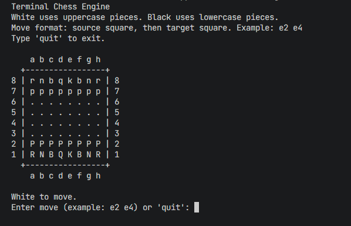

# Terminal Chess Engine

A two-player terminal chess engine written in C++. The project renders an 8x8 board in the command line, accepts coordinate-based moves, validates legal chess movement, protects king safety, handles captures, promotes pawns, and detects checkmate or stalemate.

## Features

- Plays a local White vs Black chess match in the terminal.
- Uses standard board coordinates such as `e2 e4`.
- Renders the board after every valid move.
- Supports pawn, knight, bishop, rook, queen, and king movement.
- Blocks illegal movement through occupied squares.
- Prevents capturing a piece from the same side.
- Supports pawn double-step movement from the starting rank.
- Supports diagonal pawn captures.
- Promotes pawns to queens on the final rank.
- Prevents moves that leave the current player in check.
- Reports check.
- Detects checkmate and stalemate.

## Move Format

Enter the source square first, then the target square:

```text
e2 e4
```

Examples:

```text
g1 f3
b8 c6
d2 d4
```

Type `quit` or `q` to exit the game.

## Tech Stack

| Part | Tech |
| --- | --- |
| Language | C++ |
| Standard | C++17 |
| Interface | Terminal |
| Build | Makefile or direct `g++` compile |

## Screenshots

### Welcome Screen



### Gameplay


## Project Structure

```text
.
|-- main.cpp       # Chess board, move validation, and terminal game loop
|-- Makefile       # Build, run, and clean commands
|-- .gitignore     # Local binaries and build output exclusions
`-- README.md
```

## Run On Windows With MSYS2 UCRT64

Install MSYS2 from:

```text
https://www.msys2.org/
```

Open the **MSYS2 UCRT64** terminal and update packages:

```bash
pacman -Syu
```

If MSYS2 asks you to close the terminal, close it, open **MSYS2 UCRT64** again, then install the compiler and Make:

```bash
pacman -S mingw-w64-ucrt-x86_64-gcc make git
```

Add the UCRT64 compiler to your Windows user PATH if you want `g++` available from PowerShell:

```text
C:\msys64\ucrt64\bin
```

After updating PATH, close and reopen your terminal, then verify:

```bash
g++ --version
make --version
```

Clone and run:

```bash
git clone https://github.com/haiderrrrrrr/cpp-terminal-chess-engine.git
cd cpp-terminal-chess-engine
make
make run
```

If the repository is already downloaded in `Documents/GitHub`, run:

```bash
cd /c/Users/haide/Documents/GitHub/cpp-terminal-chess-engine
make
make run
```

## Run On Windows With MinGW

Install MinGW-w64 and add its `bin` folder to PATH. Common examples:

```text
C:\mingw64\bin
C:\MinGW\bin
```

Verify:

```powershell
g++ --version
```

Compile and run from PowerShell:

```powershell
g++ -std=c++17 -Wall -Wextra -O2 main.cpp -o terminal-chess-engine.exe
.\terminal-chess-engine.exe
```

## Run On Ubuntu Or WSL

Install the compiler and Make:

```bash
sudo apt update
sudo apt install build-essential git
```

Clone and run:

```bash
git clone https://github.com/haiderrrrrrr/cpp-terminal-chess-engine.git
cd cpp-terminal-chess-engine
make
make run
```

## Common Commands

Build:

```bash
make
```

Run:

```bash
make run
```

Clean build output:

```bash
make clean
```

Direct compile:

```bash
g++ -std=c++17 -Wall -Wextra -O2 main.cpp -o terminal-chess-engine
```

## Notes

This project focuses on terminal gameplay and core move legality. Castling, en passant, threefold repetition, and the 50-move draw rule are not included.
